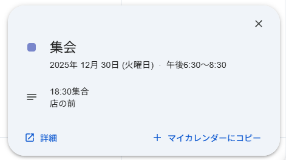

# ops_swimmer (457pt / 75 solves)

## 問題文

2025年のある日、`rain`, `debeyohiru`, `lilica` が初めて3人で集まったようです。
この日以降、この集団は活動を徐々に活発化させました。  
それはいつ・どこだったのでしょうか？  
以下の情報を教えてください。

- 日付（`YYYY/MM/DD` 形式）
- 集合時刻（`HHmm` 形式。日本時間で24時間表記）
- 場所（チェーン店名と店舗名）

例えば、2025年の10月1日の20時00分（日本時間）に、マクドナルド 新宿西口店で集合している場合、
Flagは `SWIMMER{2025/10/01_2000_マクドナルド新宿西口店}` となります。

店舗名は **公式サイト** の日本語表記に準拠します。ただし、スペース (` `) が含まれている場合、それを省いてください。

On a day in 2025, `rain`, `debeyohiru`, and `lilica` seem to have met together for the first time.  
Their activity increased from that day onward. When and where did this happen?  
Provide the following information:

- Date (`YYYY/MM/DD` format)
- Meeting time (`HHmm` 24-hour format, JST)
- Place (chain name and store name)

For example, if they met at 20:00 JST on October 1, 2025 at McDonald's Shinjuku Nishiguchi, the flag would be `SWIMMER{2025/10/01_2000_マクドナルド新宿西口店}`.

The store name will be based on the Japanese name on **its official website**. Omit spaces (` `) if it is included.

## 解法

`tgt_rain`, `tgt_debeyohiru`, `tgt_lilica` の3カテゴリを全完すると、この問題がアンロックされます。

### rainの情報

rainのXには以下のような投稿があります。

- [さっき解散した！何か新しいことが始まりそう予感（@bruto_rain, 2025年12月30日）](https://x.com/bruto_rain/status/2005982246499742052)
- [これもいつ無くなるか分からないよな 念の為記録しておこう 流石にMVは消えないと思ってるけど何があるかわからない（@bruto_rain, 2026年1月1日）](https://x.com/bruto_rain/status/2006604801514057878)
- [この前の写真整理してる ハンバーグうまかった（@bruto_rain, 2026年1月3日）](https://x.com/bruto_rain/status/2007384438939021503)

これらの投稿から、「12月30日に誰かと会い、解散したこと」「12月30日夕方に[大井町駅](https://ja.wikipedia.org/wiki/%E5%A4%A7%E4%BA%95%E7%94%BA%E9%A7%85)に行ったこと」「"この前"にハンバーグを食べたこと」が判明します。

- 「解散した」という12月30日の投稿には掲示物が写っており、「品川区」という表記が見られます。大井町駅は品川区に存在しており、[駅前のストリートビュー](https://maps.app.goo.gl/rbCuSqrk5YNNfYQr7)がこの写真と一致します。
- ハンバーグの画像をGoogle Lensに通すと、[デニーズのBEEFハンバーグステーキ](https://www.dennys.jp/menu/hamburg/beef-hamburg/)であることが判明し、デニーズに行ったことがわかります。
- 検索してみると、大井町駅付近には[デニーズ 大井町駅前店](https://shop.dennys.jp/map/21940/)があります。

### debeyohiruの情報

debeyohiru のBlueskyやnoteに人と会ったことを示す具体的な情報はありません。しかし、`debeyohiru_03_email` で得られたメールアドレスを[Epieos](https://epieos.com/)などのツールで確認してみると、以下のような予定がヒットします（直接Googleカレンダーに入力してもよいでしょう）。

> 集会
> 2025年 12月 30日 (火曜日) 午後6:30～8:30 
> 18:30集合
> 店の前

### lilicaの情報

lilicaのXには以下のような投稿があります。

- [復調しました　どうせこんな世界なら消えちゃえって思ったけど 新しいお友達が出来てそうでもないかもって思った（@twilight_lilica, 2026年1月3日）](https://x.com/twilight_lilica/status/2007446852602327054)
- [この前コミケ前にお友達と会ってきたのもある この世界を再構成する　絶対にする（@twilight_lilica, 2026年1月3日）](https://x.com/twilight_lilica/status/2007446852602327054)
- [その時の写真　食べかけだけど（@twilight_lilica, 2026年1月3日）](https://x.com/twilight_lilica/status/2007451888996724926)

これらの投稿から、「コミケ前に"友達"と会った」「パスタを食べたこと」が判明します。また、パスタの画像には「Denny's」と書かれたグラスが写っているほか、左奥にはrainの投稿にあったハンバーグが写っていることも確認できます。また、コミケ（コミックマーケット）は2025年12月30日（火）～31日（水）で開催されており、時期が一致することもわかります。

### これらから導かれること

- debeyohiruには「集会」の用事があり、2025年12月30日18:30に何らかの店の前で集まったこと
- rainは12月30日の夕方に大井町駅に行き、近辺で何らかの用事に参加したこと
- rainがデニーズのハンバーグを食べていること
- lilicaがコミケ前に「友達」と会い、デニーズを訪れていること
- lilicaがデニーズを訪れた時には同行者が2名おり、そのうち1名はハンバーグを食べていること
- lilicaが訪れているデニーズの店内の様子は、デニーズ大井町駅前店の店内写真としてGoogle Mapsに投稿されているものと大きく相違がないこと

問題文で示された情報と、上記の情報をもとに、Flagは以下の通りであると判断できます。

Flag: **`SWIMMER{2025/12/30_1830_デニーズ大井町駅前店}`**