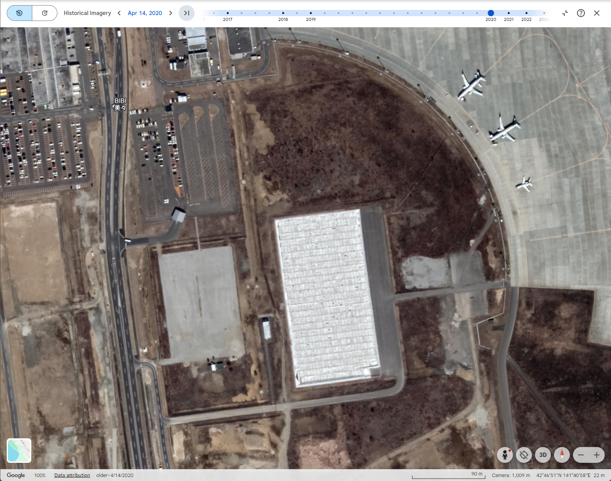

# satellite_imagery (100pt / 344 solves)

## 問題文

この衛星画像が取得（撮影）された日はいつでしょうか？ `YYYY/MM/DD` 形式で解答してください。  
例えば2026年1月17日の場合、Flagは `SWIMMER{2026/01/17}` となります。

When was this satellite image captured? Please answer in the `YYYY/MM/DD` format.  
For example, if the date was January 17, 2026, the flag would be `SWIMMER{2026/01/17}`.

## 配布ファイル

- [satellite_imagery.jpg](./public/satellite_imagery.jpg)

## 解法

画像中に `ケータリングビル` と `美々` という文字列が見えます。これをそのままGoogle検索すると、新千歳空港付近の建物がヒットします。その付近の地図とこの衛星画像を比較すると、同じ地点であることと判断できるため、この画像が新千歳空港付近の衛星画像であることがわかります。

- https://map.yahoo.co.jp/v3/place/wbZWHAQrQJE
- https://maps.app.goo.gl/3mTe5pDMcQYMdzHRA

さて、画像の右下に Google Earth と記載されていることから、この画像がGoogle Earth上で閲覧可能であるとわかります。[Google Earth](https://earth.google.com/)で「新千歳空港」などと検索して、この地点を表示してみましょう。

その状態で、画面上にある Show Historical Imagery ボタンをクリックしてみましょう。  
すると、現在表示しているエリアにおける過去の衛星画像が表示できます。

与えられた画像は、駐機場や駐車場の様子を比較すると、2025年4月18日（Apr 18, 2025）の画像と一致することがわかります。

Flag: **`SWIMMER{2025/04/18}`**

## 競技中の対応について

閲覧している環境のタイムゾーンで表示されるため `SWIMMER{2025/04/17}` もFlagとして追加し、すでに送信された解答についても遡及して正解扱いにする対応を行っています。ご迷惑をおかけして申し訳ありませんでした。また、競技中のご指摘に感謝いたします。