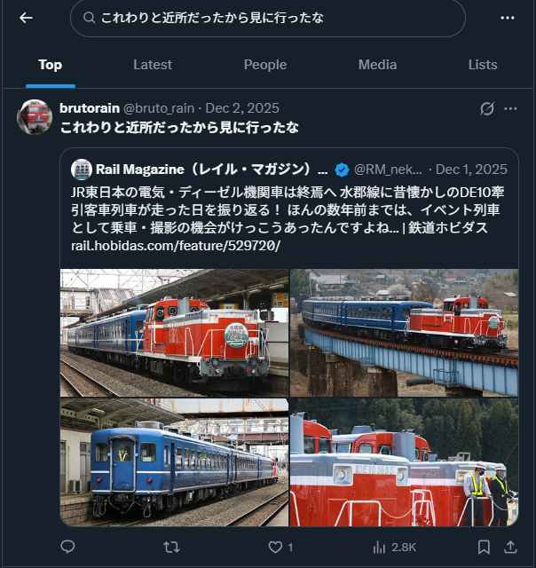

# rain_01_social (100pt / 554 solves)

## 問題文

`rain` は2026年時点でXのアカウントを所持していたようです。  
我々は、この人物の投稿のスクリーンショットを入手しました。

スクリーンショットからアカウントを特定し、このアカウントのID（スクリーンネーム）を解答してください。

例えば、[@gov_online](https://x.com/gov_online) が対象のアカウントの場合、Flag は `SWIMMER{@gov_online}` となります。

As of 2026, `rain` appears to have had an X account.  
We have obtained a screenshot of their post.

Identify the account from the screenshot, and answer the account's ID (screen name).

For example, if the target account were [@gov_online](https://x.com/gov_online), the flag would be `SWIMMER{@gov_online}`.

## 配布ファイル

- [rain_01_social.jpg](./public/rain_01_social.jpg)

## 解法

添付されている画像には以下の文章が記載されています。もし、日本語を入力できない環境だったとしても、Google Lensなどのツールを利用すると書き起こすことが可能です。

> これわりと近所だったから見に行ったな

この文章をXで検索すると、1件のツイートがヒットします。

これより、以下のアカウントがrainのものであるとわかります。

https://x.com/bruto_rain

Flag: **`SWIMMER{@bruto_rain}`**